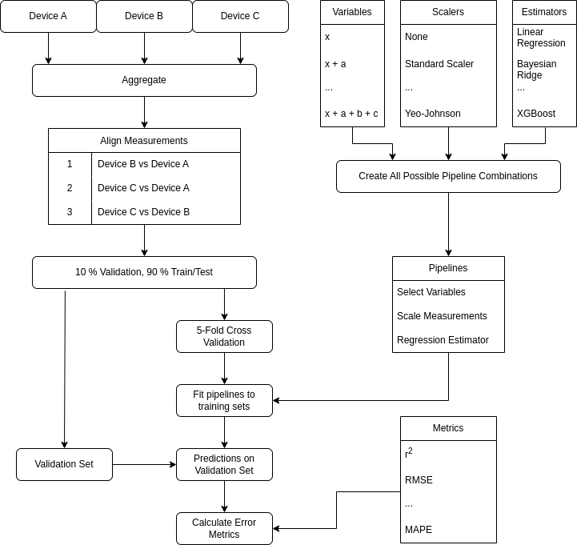

<h1 align="center">
	Graddnodi
</h1>

**Contact**: [CaderIdrisGH@outlook.com](mailto:CaderIdrisGH@outlook.com)

---

## Table of Contents

1. [Introdution](##introduction)
1. [Input](##input)
1. [Output](##output)
1. [Requirements](##requirements)
1. [Setup](##setup)
1. [Standard Operating Procedure](##standard-operating-procedure)
1. [Settings](##settings)
1. [Data Dictionary](##data-dictionary)

---

## Introduction

Graddnodi (en: Calibration) is a program developed as part of a suite of tools designed to analyse the data generated by low-cost air quality sensors and attempt to assess their quality, remove outliers, detect malfunctions and calibrate them over both short distances (collocation) and long distances (experimental pseudo-collocation). 
Graddnodi assesses the calibrates measurements made during a collocation study and assesses their quality via a range of error calculcations.

Graddnodi can output both the results of the calibrations and summary statistics detailing the best performing calibratino techniques and secondary variables to use in multivariate calibrations.
Therefore this program can not only identify the best calibration technique to use for different types of air quality monitors but also allow you to correct the measurements produced by these devices using the best calibration technique.

This program was tested on a data generated during a long-term collocation study performed at the National Physical Laboratory in Teddington. 
Many different air quality monitors were deployed there, both low and high-cost.
They measured a range of pollutants and environmental conditions (e.g temperature, relative humidity) to varying degrees of quality.
The measurements were collected, standardised and uploaded to an InfluxDB 2.x database (using a suite of programs you can find [here](https://github.com/stars/CaderIdris/lists/influxdb-2-x-upload)) before being aggregated in Graddnodi.

---

## Input

---

## Output

---

## Requirements

This program imports data from an InfluxDB 2.x database. Several examples of importing different data formats to an InfluxDB database can be found here. The structure of the data should not matter as the Flux query is dynamically generated in [the config file](./Settings/config.json)

---

## How to Use 

|Flag|Flag|Description|Default|
|---|---|---|---|
|-c|--config-path|Path to the config file|Settings/config.json|
|-i|--influx-path|Path to the influx config|Settings/influx.json|
|-o|--output-path|Where the output is saved to|Output/|
|-f|--full-output|Include full output in saved report (eCDFs, scatter plots, Bland-Altman plots etc)|False, True if called|

---

## Setup

---

## Settings

